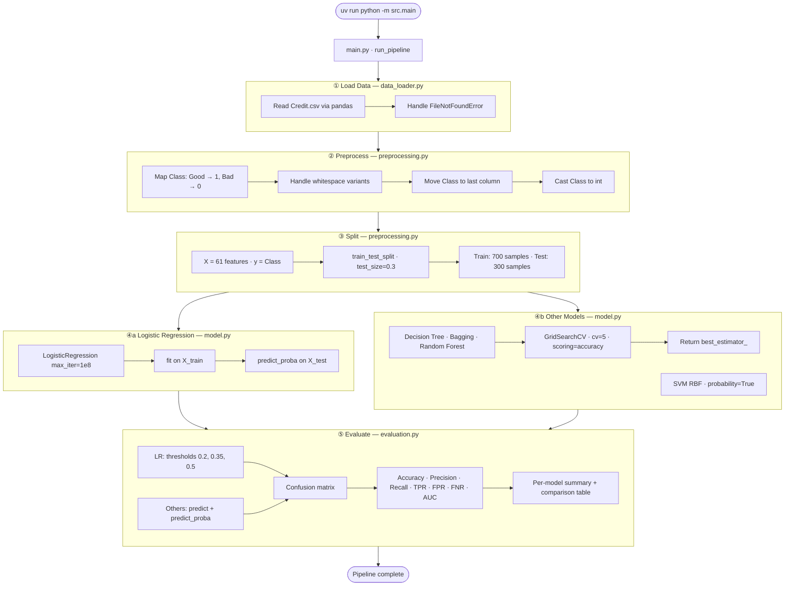
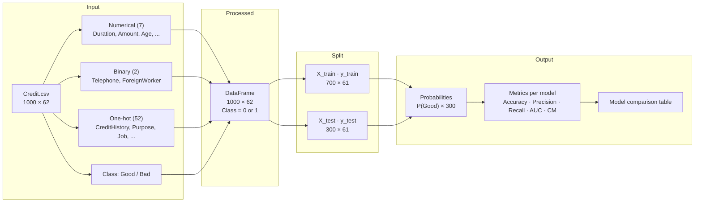
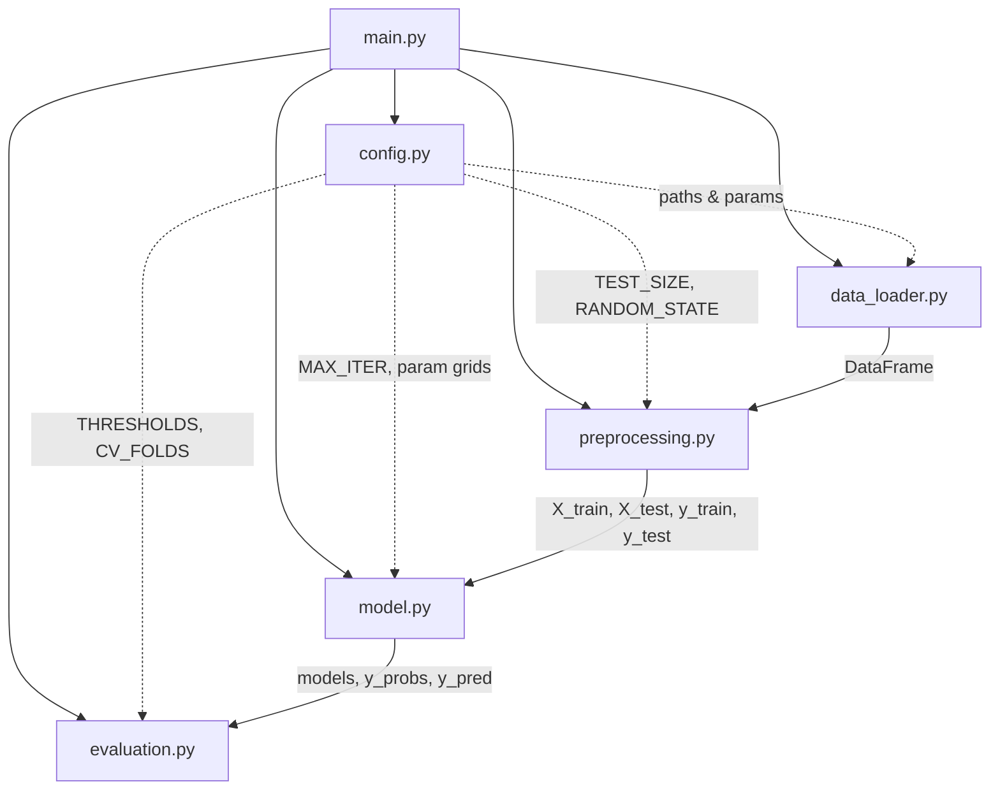
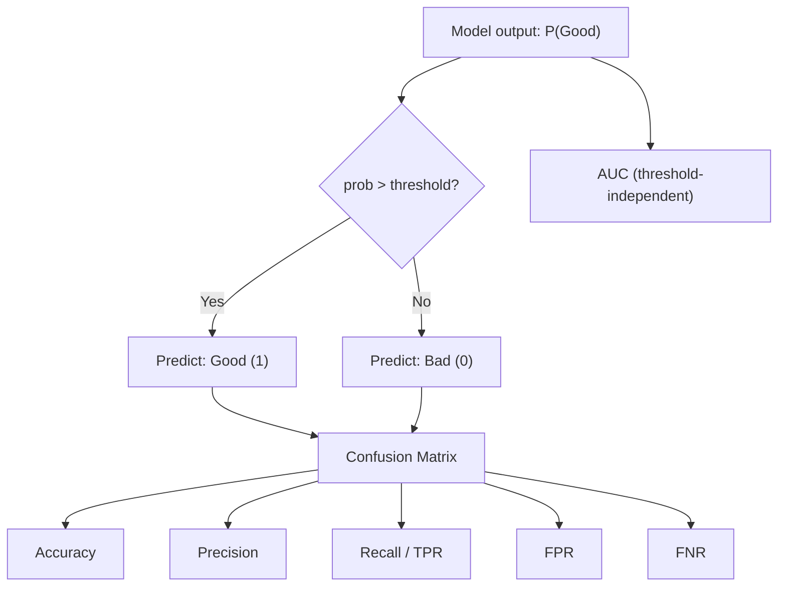

# Credit Risk Assessment — Architecture

## Overview

Binary classification pipeline that predicts whether a loan applicant is a **Good** or **Bad** credit risk. The production flow lives in `src/` and is orchestrated by `main.py`. Configuration is centralized in `config.py`.

| Item | Value |
|------|-------|
| Dataset | `data/Credit.csv` — 1,000 rows, 62 columns |
| Features | 61 (7 numerical + 2 binary + 52 one-hot categoricals) |
| Target | `Class` — Good (1) / Bad (0) |
| Models | Logistic Regression, Decision Tree, Bagging, Random Forest, SVM (RBF) |
| Tuning | GridSearchCV (5-fold CV) for tree-based ensemble models |
| Split | 70% train / 30% test (`random_state=42`) |

---

## ML Pipeline



---

## Data Flow



---

## Module Structure



| Module | Key Functions | Responsibility |
|--------|---------------|----------------|
| `config.py` | — | Paths, split params, thresholds, GridSearchCV grids |
| `data_loader.py` | `load_credit_data()` | Load CSV from `data/Credit.csv` |
| `preprocessing.py` | `preprocess_data()`, `split_credit_data()` | Target encoding, column order, train/test split |
| `model.py` | `train_*()`, `get_all_trainers()`, `get_prediction_probabilities()` | Train all models; tune tree ensembles via GridSearchCV |
| `evaluation.py` | `calculate_metrics()`, `calculate_predict_metrics()`, `print_model_comparison()` | Threshold and hard-prediction metrics, comparison table |
| `main.py` | `run_pipeline()` | Orchestrates load → preprocess → train → evaluate |

---

## Models

| Model | Training | Threshold tuning |
|-------|----------|------------------|
| **Logistic Regression** | Direct fit (`max_iter=1e8`) | Yes — evaluated at 0.2, 0.35, 0.5 |
| **Decision Tree** | GridSearchCV on `max_depth` | No — uses `predict()` |
| **Bagging** | GridSearchCV on `n_estimators`, `max_features` | No |
| **Random Forest** | GridSearchCV on `n_estimators`, `max_features` | No |
| **SVM (RBF)** | Direct fit (`probability=True`) | No |

### GridSearchCV configuration

Defined in `config.py`:

| Model | Parameter grid |
|-------|----------------|
| Decision Tree | `max_depth`: [3, 4, 5, 6, 7, 8, 10, 20] |
| Bagging | `n_estimators`: [100, 150, 200], `max_features`: [0.5, 0.7, 1.0] |
| Random Forest | `n_estimators`: [100, 150, 200], `max_features`: [0.5, 0.7, 1.0] |

All grid searches use **5-fold cross-validation** with **accuracy** as the scoring metric. The pipeline prints the best parameters and CV score, then retrains using `best_estimator_`.

---

## Threshold Evaluation Logic (Logistic Regression)



| Threshold | Trade-off |
|-----------|-----------|
| **0.2** | High TPR (~99%) — approve almost all Good, but also many Bad |
| **0.35** | Balanced recall — ~95% Good approved |
| **0.5** | Default — best accuracy (~77%), moderate FPR |

---

## Project Layout

```
credit_risk_assessment/
├── data/Credit.csv              # Dataset
├── src/
│   ├── config.py                # Paths, thresholds, GridSearchCV grids
│   ├── data_loader.py           # Step 1: Load
│   ├── preprocessing.py         # Step 2–3: Preprocess & split
│   ├── model.py                 # Step 4: Train & tune models
│   ├── evaluation.py            # Step 5: Metrics & comparison
│   └── main.py                  # Pipeline entry point
├── tests/
│   ├── test_data_loader.py
│   ├── test_preprocessing.py
│   ├── test_evaluation.py
│   └── test_model_tuning.py
├── Credit-risk-assessment-in-banking-1.ipynb   # EDA, plots, KNN experiments
├── pyproject.toml               # Dependencies (uv)
└── architecture.md              # This file
```

---

## Run

```bash
uv run python -m src.main
uv run python -m pytest tests/
```

The pipeline prints:
1. Logistic regression metrics at each threshold (0.2, 0.35, 0.5)
2. GridSearchCV best params for Decision Tree, Bagging, and Random Forest
3. Test-set metrics for all non-LR models
4. A side-by-side model comparison table
