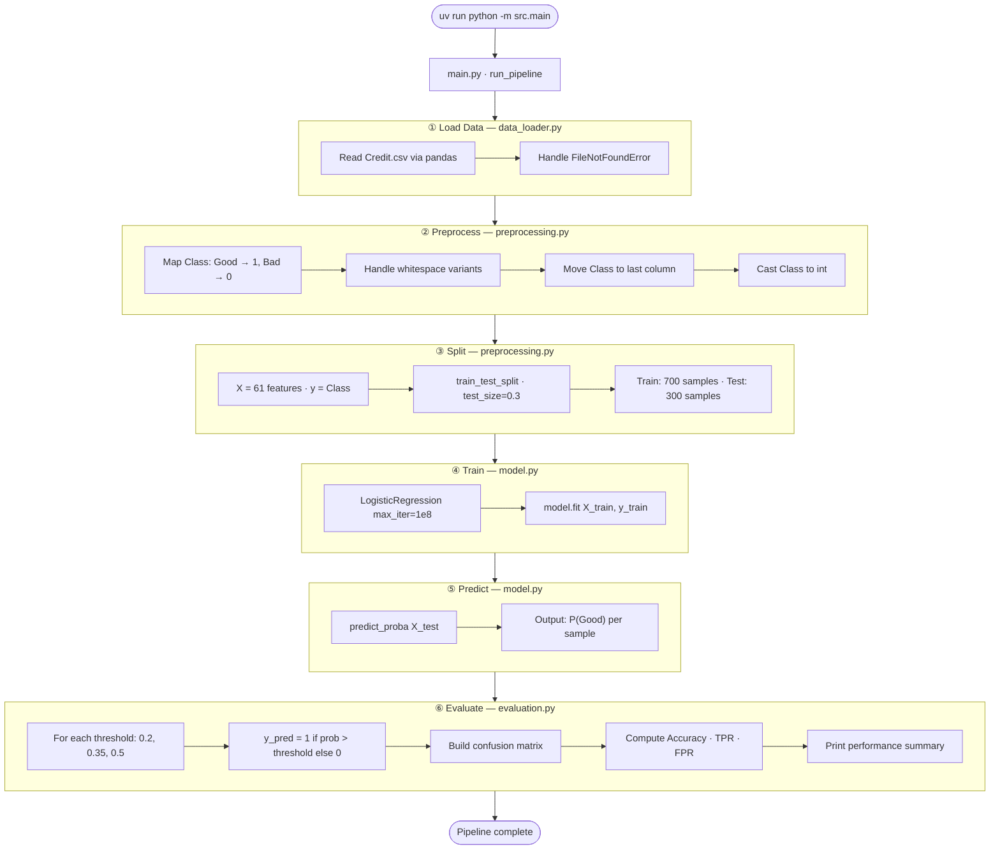
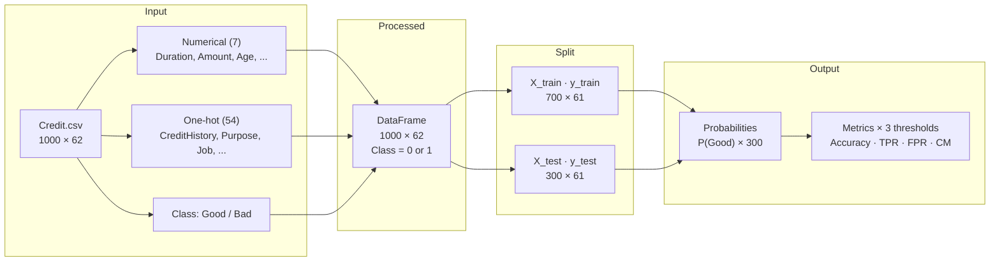
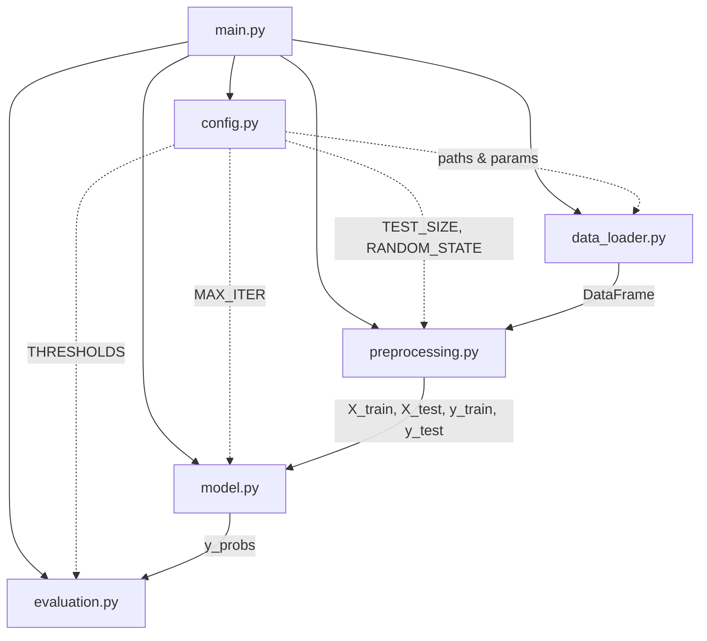
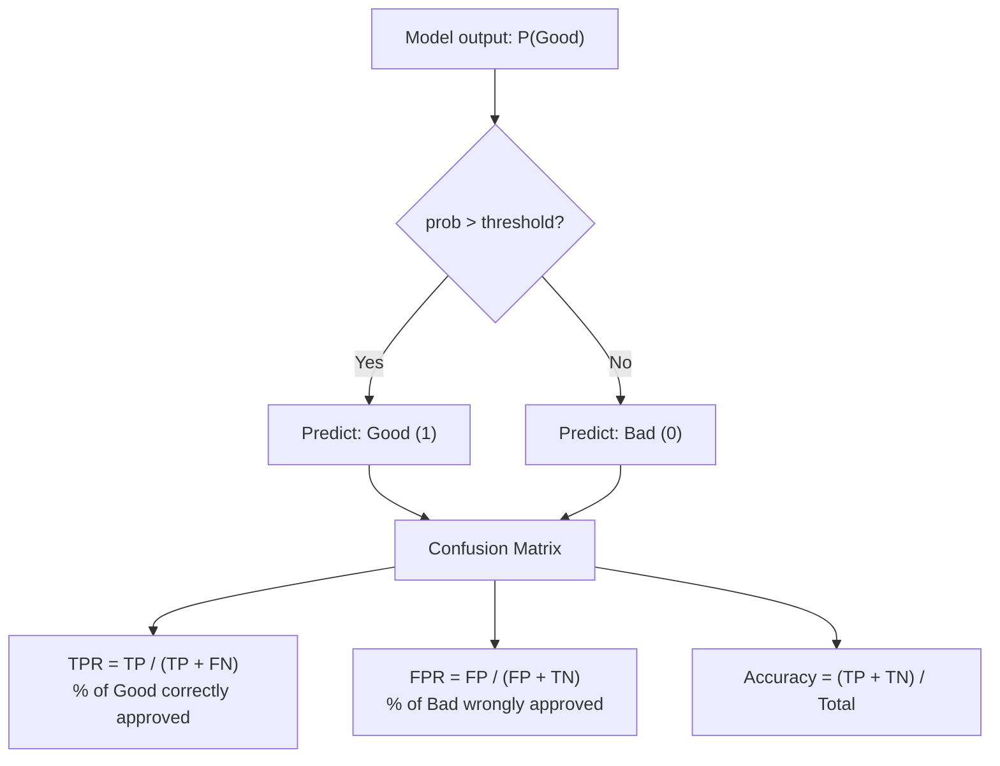

# Credit Risk Assessment — Architecture

## Overview

Binary classification pipeline that predicts whether a loan applicant is a **Good** or **Bad** credit risk. The production flow lives in `src/` and is orchestrated by `main.py`. Configuration is centralized in `config.py`.

| Item | Value |
|------|-------|
| Dataset | `data/Credit.csv` — 1,000 rows, 62 columns |
| Features | 61 (7 numerical + 54 one-hot encoded categoricals) |
| Target | `Class` — Good (1) / Bad (0) |
| Model | Logistic Regression |
| Split | 70% train / 30% test (`random_state=42`) |

---

## ML Pipeline



---

## Data Flow



---

## Module Structure



| Module | Key Functions | Responsibility |
|--------|---------------|----------------|
| `config.py` | — | Paths, `RANDOM_STATE=42`, `TEST_SIZE=0.3`, `THRESHOLDS`, `MAX_ITER` |
| `data_loader.py` | `load_credit_data()` | Load CSV from `data/Credit.csv` |
| `preprocessing.py` | `preprocess_data()`, `split_credit_data()` | Target encoding, column order, train/test split |
| `model.py` | `train_logistic_regression()`, `get_prediction_probabilities()` | Fit LR model, return P(Good) |
| `evaluation.py` | `calculate_metrics()`, `print_performance_summary()` | Threshold-based metrics and reporting |
| `main.py` | `run_pipeline()` | Wires all steps in sequence |

---

## Threshold Evaluation Logic



| Threshold | Trade-off |
|-----------|-----------|
| **0.2** | High TPR (~99%) — approve almost all Good, but also many Bad |
| **0.35** | Balanced recall — ~95% Good approved |
| **0.5** | Default — best accuracy (~77%), moderate FPR |

---

## Project Layout

```
credit_risk_assessment/
├── data/Credit.csv              # Dataset
├── src/
│   ├── config.py                # Configuration
│   ├── data_loader.py           # Step 1: Load
│   ├── preprocessing.py         # Step 2–3: Preprocess & Split
│   ├── model.py                 # Step 4–5: Train & Predict
│   ├── evaluation.py            # Step 6: Evaluate
│   └── main.py                  # Pipeline entry point
├── tests/                       # Unit tests (loader, preprocessing)
├── Credit-risk-assessment-in-banking-1.ipynb   # EDA & model experiments
├── pyproject.toml               # Dependencies (uv)
└── architecture.md              # This file
```

---

## Run

```bash
uv run python -m src.main
uv run python -m pytest tests/
```
